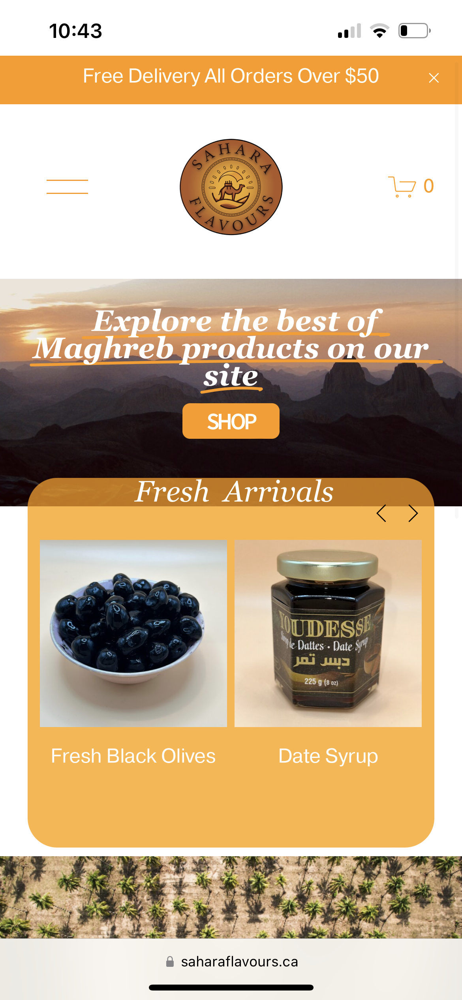
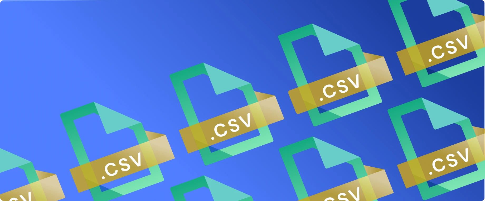
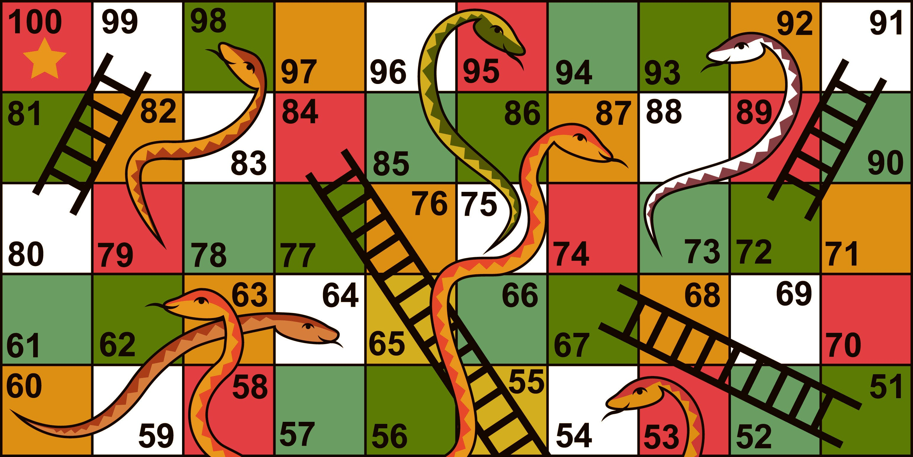
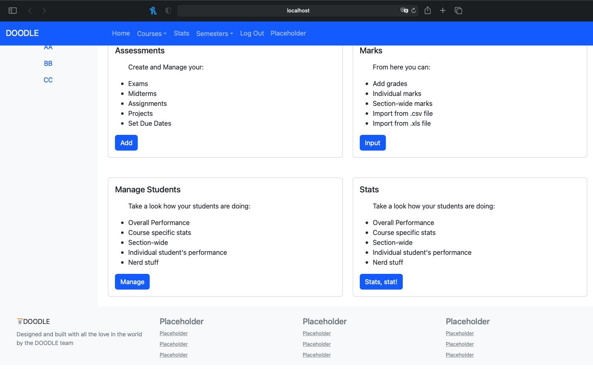

## Education

-  **B.Sc, in Computer Science and Mathematics and Statistics- Concordia University (_2020- May 2024_)**

-  **DEC, Pure & Applied Science	-  Dawson College  (_2017-2019_)**	 		

##  Skills
- **Coding Languages**: Java, Python, C, Clojure, JavaScript, HTML/CSS, PHP, SQL, R, MAPLE, XML, Mathematica
- **Developer Tools & Platforms**: Eclipse, Visual Studio Code, GitHub, Git, Jira, Docker, Linux, Power BI, IntelliJ,
  ROSS ERP, Microsoft Office (Excel, PowerPoint, etc.)
- **Spoken Languages**: English - Native, French - Native, Berber languages - Native

## Work Experience

 **Software Programmer Intern @ Saint-Gobain (BP Canada)** - _Montreal QC, (May- August 2023)_
 
• Developed a new intranet website, using HTML, CSS, PHP, SQL, and JavaScript, to enhance resource accessibility and communication efficiency across more than five departments.
• Replaced the marketing department’s website with an integrated Ross ERP module, reducing procurement processing time by 30% and operational overhead by 40%.
• Utilized SQL queries for data refinement, resulting in a higher accuracy for locating product retailers within Canadian regions.
• Implemented Agile methodology using Jira for intranet development, achieving 95% satisfaction post-launch.

 **Credit Analyst Intern @ Bank of Montreal (BMO)** - _Montreal QC, (May-August 2022)_

• Analyzed financial statements for 20+ CRM companies to assess credit risk and determine suitability for credit extension.
• Contributed to a 36% reduction in annual reviews backlog by assisting with data entry, report generation, and financial analysis, thereby enhancing team performance.
• Adapted successfully to the fast-paced environment of the banking industry, demonstrating adaptability, initiative, and a strong work ethic, resulting in positive feedback from supervisors and peers alike.
  
## Projects 

### SaharaFlavours (Freelance Web development)

• Launched a website for SaharaFlavours, boosting brand visibility, customer engagement, and attracting 200+ new customers.
• Added 500+ lines of custom CSS, HTML, and JavaScript to enhance functionality and design, including a WhatsApp chat feature, tailoring the user experience to customer demands.
• Collaborated with stakeholders to gather requirements and deliver tailored solutions, strengthening client relationships and achieving business goals.

### Python Guessing Game  
[GitHub Repository](https://github.com/djouher-al/Python_WordGame)

#### Description:
Developed "The Great Guessing Game," a Python command-line application challenging users to guess a 4-letter word. Implemented features such as clear screen functionality, game modes (Play and Test), and scoring system, providing an engaging user experience.

#### Skills Showcased:
- **Python Programming:** Demonstrated proficiency in Python programming, utilizing core language features for game logic implementation.
- **Object-Oriented Programming (OOP):** Applied OOP principles by creating a `Game` class to manage game state and functionality.
- **File Handling:** Used file handling techniques to manage external data files containing word databases.
- **String Manipulation:** Employed string manipulation for processing user input and displaying game status.
- **Command-Line Interface (CLI) Development:** Developed a CLI using Python's `os` module for screen clearing and argparse for command-line argument parsing.
- **Error Handling:** Implemented error handling mechanisms to ensure application stability and reliability.
- **Documentation:** Provided clear documentation and comments to enhance code readability and maintainability.

###  Simple Data Generation Application 
[GitHub Repository](https://github.com/djouher-al/C_Data-Generation-App)

#### Description:
Developed "TableGen," a simple data generation application designed to create realistic test sets for databases or other data management systems. The application provides an intuitive interface for users to build custom tables with specified columns, row counts, and output file names.

#### Skills Showcased:
- **C Programming:** Demonstrated proficiency in C programming, implementing core functionalities and user interfaces for data generation.
- **Menu System:** Designed a menu-driven interface with options for building a table, selecting columns, defining sort criteria, and specifying output details.
- **File I/O:** Utilized file input/output operations to manage the generation and storage of data tables in CSV format.
- **Clearing Screen:** Implemented screen clearing functionality for a clean display using the system function from the stdlib.h library.
- **Data Formatting:** Ensured proper formatting of generated data, including header rows, column order, sorting, and formatting of phone numbers.
- **User Input Handling:** Implemented robust user input handling to validate and process user-provided data, ensuring smooth interaction and preventing errors.

###  Ladder and Snake Game

[GitHub Repository](https://github.com/djouher-al/Java_Ladder-Snake_game)

#### Description:
Developed a Java application called "Ladder-Snake Game" based on the popular board game concept. The project aimed to recreate the classic gameplay experience in a digital format using Java programming language, providing an interactive and enjoyable gaming experience.

#### Skills Showcased:
- **Java Programming:** Demonstrated proficiency in Java programming language, implementing core game mechanics, user interface elements, and game logic.
- **Object-Oriented Programming (OOP):** Applied OOP principles to design and structure the game, using classes and objects to represent game entities such as players, board cells, and game rules.
- **Game Logic Implementation:** Implemented the logic for game rules, including movement of players, handling of ladder and snake interactions, and determining game outcomes.
- **Data Structures:** Utilized appropriate data structures such as arrays, lists, or maps to represent game elements and manage game state efficiently.
- **Code Organization:** Organized the codebase into modular components, separating concerns and promoting code reusability, readability, and maintainability.
- **Testing and Debugging:** Conducted testing and debugging to identify and resolve issues, ensuring the stability and reliability of the game application.

### File Compression and Decompression Application

[GitHub Repository](https://github.com/djouher-al/Clojure_File-Compression-and-Decompression-Application)

#### Description:
Created a Clojure application for file compression and decompression, aiming to provide users with a simple yet effective solution for managing file storage and transmission efficiently. The project focused on implementing compression algorithms to reduce file sizes and decompression algorithms to restore files to their original state, enhancing data management and transfer processes.

#### Skills Showcased:
- **Clojure Programming:** Demonstrated proficiency in Clojure programming language, utilizing its functional programming features and immutable data structures to implement file compression and decompression algorithms.
- **Data Transformation:** Utilized functional programming paradigms to transform and manipulate data streams, optimizing file compression and decompression processes.
- **File I/O Operations:** Implemented file input/output operations to read input files, perform compression or decompression, and write output files, ensuring seamless integration with the file system.
- **Testing and Validation:** Conducted testing and validation to ensure the correctness and efficiency of compression and decompression algorithms, validating data integrity and compression ratios for different types of input files.

### Academic Management System (CSS, HTML, JavaScript, PHP, SQL)

[GitHub Repository](https://github.com/djouher-al/Project5_Web_Programming)

#### Description:
Developed the Academic Management System, a comprehensive web platform designed to streamline the management of assessments, grades, and statistics for teachers and students. The system offers a range of features tailored to the specific needs of each user role, providing valuable insights and facilitating efficient academic management.

#### Skills Showcased:
- **Web Development:** Implemented a web-based platform using HTML, CSS, and JavaScript to create an interactive and user-friendly interface for teachers and students.
- **User Authentication and Authorization:** Implemented user authentication and authorization mechanisms to secure access to sensitive data and ensure privacy and data integrity.
- **Collaborative Development:** Contributed to the project collaboratively, working with other team members to implement features, resolve issues, and enhance the overall functionality and usability of the Academic Management System.
- **Testing and Quality Assurance:** Conducted testing and quality assurance measures to identify and resolve bugs, ensure functionality across different devices and browsers, and maintain the reliability and performance of the system.

